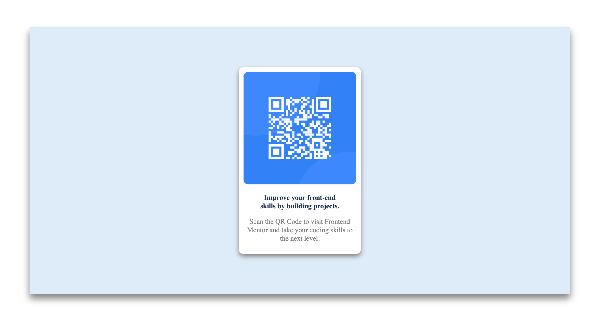

# Frontend Mentor - QR code component solution

This is a solution to the [QR code component challenge on Frontend Mentor](https://www.frontendmentor.io/challenges/qr-code-component-iux_sIO_H). Frontend Mentor challenges help you improve your coding skills by building realistic projects. 

## Table of contents

- [Overview](#overview)
  - [Screenshot](#screenshot)
  - [Links](#links)
  - [Built with](#built-with)
  - [Useful resources](#useful-resources)
- [Author](#author)

**Note: Delete this note and update the table of contents based on what sections you keep.**

## Overview
  A responsive qr code component built using css flexbox and other components
### Screenshot

###links
-https://responsiveqrcodecomponent.netlify.app/

### Built with

- Semantic HTML5 markup
- CSS custom properties
- Flexbox
- Css Responsive Design properties

### Useful resources

- [Example resource 1](https://www.w3schools.com) - This is an amazing website which helped me to understand . I'd recommend it to anyone still learning.

## Author

- Github - [Eniola Anishe](https://github.com/Eniolasoar)
- Frontend Mentor - [@Eniolasoar](https://www.frontendmentor.io/profile/Eniolasoar)

